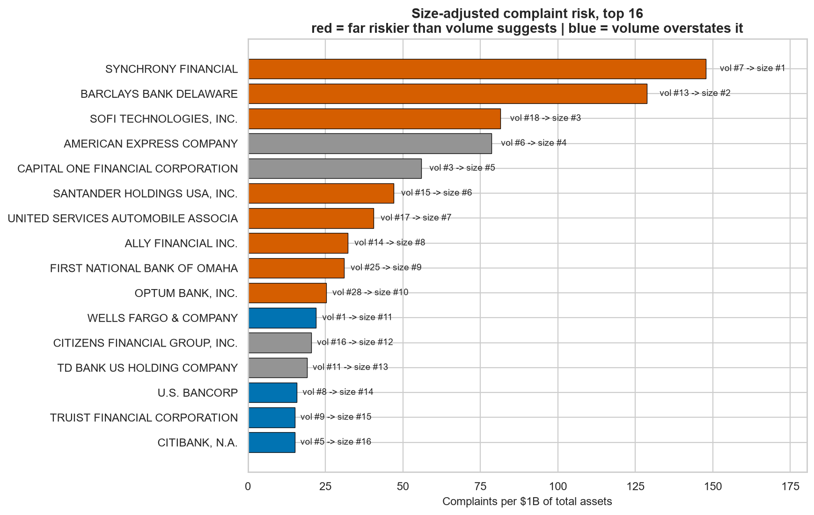
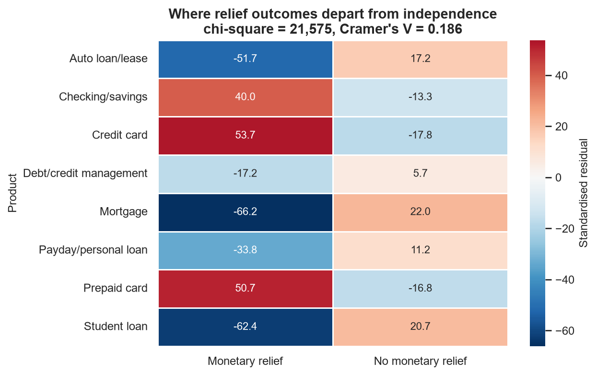
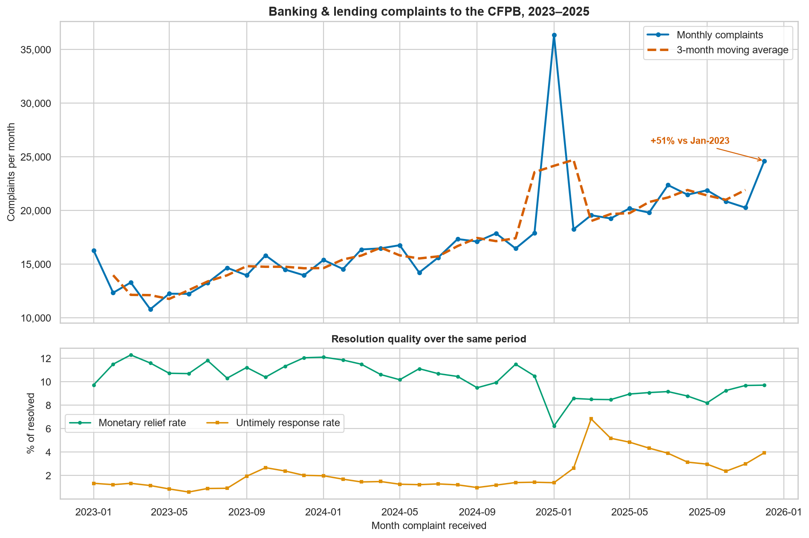

# US Banking Consumer Complaints — Risk & Resolution Analysis

End-to-end analytics project on the **CFPB Consumer Complaint Database**: Python
ingestion → pandas cleaning → external enrichment → PostgreSQL warehouse → SQL
analysis → statistical testing → Tableau dashboard.

**624,708 complaints · 3,193 companies · 36 months · PostgreSQL + Tableau**

> **Status:** complete. All 9 stages built and documented — see
> [Project stages](#project-stages). Every log in `reports/` is *generated by the
> script that produced it*, so no figure in this repo can drift from the data it
> describes.

---

## Problem statement

Complaint *volume* is a misleading risk signal. The biggest banks naturally
generate the most complaints because they have the most customers. The question
that actually matters to a risk or compliance team is what's left after you
control for size.

**Primary business question**

> Which US financial companies and products generate the most consumer risk, and
> — after adjusting for company size — which companies actually resolve
> complaints *worst* (lowest monetary-relief rate / highest untimely-response
> rate)?

Supporting questions:

1. How has complaint volume trended by product since 2023, and which products are accelerating?
2. Which companies look safe on raw volume but are outliers once normalised per $1B of assets?
3. Is complaint outcome (monetary relief vs. no relief) statistically independent of the company handling it?
4. Which issues and states concentrate the most risk?

## Data

| Source | What it gives us | Link |
|---|---|---|
| CFPB Consumer Complaint Database | Complaint-level records: date, product, issue, company, state, company response, timeliness, disputes | [API docs](https://cfpb.github.io/api/ccdb/) · [Search UI](https://www.consumerfinance.gov/data-research/consumer-complaints/) |
| FDIC BankFind Suite API | Insured institution total assets — the denominator for size-adjusted risk | [banks.data.fdic.gov](https://banks.data.fdic.gov/docs/) |
| FRED (optional) | Unemployment rate, CPI — macro context for complaint volume | [fred.stlouisfed.org](https://fred.stlouisfed.org/) |

**Scope:** complaints received **2023-01-01 → 2026-01-01**, pulled via the CFPB
API (not the 5–6 GB bulk download). Raw data is never committed; a 1,000-row
sample lives at [`data/sample_1000.csv`](data/sample_1000.csv) so you can see the
schema without downloading anything.

### Scope decision: why credit reporting is excluded

This is the single most consequential choice in the project, so it is stated up
front rather than buried.

The date window contains **9,478,443 complaints**. Filtering to banking and
lending products leaves **624,727** — a 93% reduction. The excluded categories:

| Excluded | Rows | Why |
|---|---:|---|
| Credit reporting (2 legacy labels) | 8,230,677 | Filed against Equifax, Experian and TransUnion — consumer reporting agencies, **not FDIC-insured depository institutions**. They have no total-assets denominator, so the headline size-adjusted metric is undefined for them. At 87% of all rows they would also dominate every product, issue, state and trend breakdown. |
| Debt collection | 507,831 | Overwhelmingly third-party collection agencies (Portfolio Recovery, Encore Capital), again not FDIC-insured. |
| Money transfer / virtual currency | 115,208 | Non-bank fintechs (PayPal, Block, Coinbase, Western Union). Topical, but outside the size-adjusted ranking. |

What remains is **10 product categories that a bank or lender actually sells** —
checking/savings, credit card, prepaid card, mortgage, auto, student loan,
payday/personal loan, and debt-or-credit management — which is exactly the
population the FDIC asset join can normalise.

> **The honest caveat:** this makes the analysis a *banking* risk analysis, not a
> whole-of-CFPB analysis. Any statement about "consumer complaints" in this
> project means complaints about banking and lending products. Volume rankings
> here will not match headline CFPB figures, which are driven by credit reporting.

### Data handling: narrative text is split out, not dropped

`complaint_what_happened` is present on ~46% of rows and accounts for roughly
70% of the payload. Rather than choosing between "carry the bloat" and "lose the
text", it is written to a **separate file keyed by `complaint_id`**
(`data/raw/complaint_narratives.csv`). Stages 2–8 run on the lean quantitative
table and stay fast; an optional text-analysis stage can join the narratives back
later without a re-download.

### What the extract actually contains

| | |
|---|---|
| Rows | **624,727** (matches the API's reported total exactly) |
| Date span | 2023-01-01 → 2026-01-01 |
| Distinct companies | 3,197 |
| Products | 10 |
| States/territories | 61 |
| Complaints with narrative text | 341,894 (54.7%) |
| `complaints.csv` | 176 MB · `complaint_narratives.csv` 405 MB (both gitignored) |

Rows per year:

| Year | Complaints |
|---|---:|
| 2023 | 163,324 |
| 2024 | 196,037 |
| 2025 | 264,853 |
| 2026 | **513** ⚠️ |

> ⚠️ **2026 is a one-day stub.** The window ends 2026-01-01, so 2026 contributes a
> single day. Left untreated it renders as a cliff in any yearly or monthly trend
> chart. Stage 2 flags these rows and the trend analysis is bounded to
> **2023-01-01 → 2025-12-31** (36 complete months) so period-over-period
> comparisons are like-for-like.

### API gotcha worth knowing

Passing `format=json` to the CFPB search API silently routes the request to the
**export** endpoint, which caps the result set at 100,000 rows and rejects a
larger filter with `HTTP 400 — "Result set of 624727 exceeds the export limit of
100000"`. Omitting `format` entirely uses the normal search endpoint, which
returns JSON anyway and has no depth limit when paginating with `search_after`.
The `frm` offset parameter is also silently ignored past the first page, so
`search_after` is the only workable deep-pagination method.

## Methodology

1. **Acquisition** — paginated API pull using the `search_after` cursor, with retry/backoff.
2. **Cleaning** — date parsing, company-name canonicalisation via an auditable mapping table, explicit dedupe key, per-column missing-value decisions, data-quality flags. Every non-obvious decision is logged in [`reports/cleaning_log.md`](reports/cleaning_log.md).
3. **Enrichment** — fuzzy-match CFPB company names to FDIC institutions (`rapidfuzz`) to attach total assets; match rate and unmatched handling reported honestly.
4. **Warehouse** — typed PostgreSQL tables, bulk-loaded via `COPY`, indexed on company / product / state / date.
5. **Analysis** — SQL with CTEs and window functions (`RANK`, `LAG`), one file per business question in [`sql/`](sql/).
6. **Statistics** — chi-square test of independence on complaint outcome; time-series and correlation analysis.
7. **Presentation** — Tableau connected directly to Postgres views.

### Key cleaning decisions

Full reasoning with numbers in [`reports/cleaning_log.md`](reports/cleaning_log.md),
which is **generated by the script** so its figures can never drift from the data.
The four that changed the analysis:

**1. A product renaming was faking a trend break.** CFPB renamed two product
taxonomies in August 2023. Untreated, `Credit card` appears to explode out of
nowhere — and a naive read would report that as a real surge:

| Month | Raw labels | After fix |
|---|---:|---:|
| 2023-06 | **0** | 4,296 |
| 2023-07 | **0** | 4,891 |
| 2023-08 | 1,215 | 5,435 |
| 2023-09 | 4,918 | 4,918 |

The legacy `Credit card or prepaid card` label is split back into its modern
components using `sub_product`. This is lossless — its 7 sub-products map exactly
onto the 2 of `Credit card` and the 5 of `Prepaid card` (32,541 + 2,769 = 35,310,
no remainder). Max month-over-month swing at the boundary drops to 11.1%.

**2. Company-name matching is deliberately conservative — precision over recall.**
An aggressive normaliser that stripped `FINANCIAL`/`GROUP`/`BANCSHARES` as
"suffixes" produced **false merges of genuinely different banks** —
`INDEPENDENT BANK CORP.` (Rockland Trust, MA) with `INDEPENDENT BANK GROUP, INC.`
(TX). Merging two distinct institutions corrupts both their complaint counts and
their size-adjusted risk rates while leaving no visible trace. The key now
collapses case, punctuation and a *trailing* legal form only: 4 collapses over
737 rows, all verified. Recall is recovered in Stage 3 by a scored, reviewable
fuzzy match instead of a silent regex.

**3. `'In progress'` is not an outcome.** 202 complaints are still open. Counting
them in a relief-rate denominator understates every company's rate by its share
of still-open complaints — which correlates with how recently they were filed.
All outcome rates divide by `is_resolved` (624,505), not raw volume.

**4. Nothing was dropped for missing values.** `tags` (83% null) and
`company_public_response` (55% null) are *structural* absences — "no tag
applies", "company declined to comment" — not lost data. Imputing a mode would
have invented 519k servicemembers. They become explicit categories plus boolean
flags. Total rows dropped for nulls: **0**.

Also documented there: a subtle round-trip bug where filling a column with the
string `'None'` silently resurrects the nulls, because pandas treats `'None'` as
NA on read.

### Known limitation: no consumer-dispute field

CFPB **discontinued the `consumer_disputed` flag in April 2017**, and it is not
returned by the API. A dispute/escalation rate therefore cannot be computed
as such. Three substitutes derived from fields that do exist are carried forward:
`is_untimely`, `company_disputes_facts` (the company formally contests the
consumer's account), and `closed_explanation_only` (closed with no relief of any
kind).

### Headline metric

**Size-adjusted risk = complaints per $1B of total assets.**

Two rules keep it honest, both documented in
[`reports/enrichment_log.md`](reports/enrichment_log.md):

**Assets are summed across all charters under a holding company.** One CFPB
company can own several FDIC charters. Using only the largest would understate
the denominator — and therefore *inflate* the risk rate — by 38.2% for Morgan
Stanley, 19.8% for Popular Inc, 13.5% for Charles Schwab. (A related trap: 683
institutions have no holding company at all, and grouping on that blank field
would fuse 683 independent banks into one fictional $822B entity.)

**Unmatched companies are reported, not dropped.** 50% of complaint volume
belongs to entities with no FDIC assets *by design* — credit bureaus, NCUA credit
unions, loan servicers, fintechs. They keep every volume, trend and
resolution-rate metric; they drop out of the size-adjusted ranking only, and the
"unmatched but high-volume" list is published as a finding in itself.

**On fuzzy matching:** every guard in the matcher was added in response to a
specific false positive found in review, not designed up front. The first version
matched `Ocwen Financial Corporation` to `OWEN FINANCIAL CORP` — a $0.4B
community bank, one letter apart — producing a confident **7,923 complaints per
$1B**. The final matcher requires an exact normalised match, or two exact
distinctive tokens plus a Jaccard floor. A plausibility sweep flags any ratio
above 300/$1B and currently returns nothing.

## Key findings

Full write-up with recommendations: [`reports/insights.md`](reports/insights.md).

### 1. Raw complaint volume is a size proxy, not a risk signal

Wells Fargo (41,051 complaints) and JPMorgan Chase (40,391) look like the same
risk. JPMorgan holds **2.2× the assets** — so per dollar of balance sheet, Wells
Fargo generates **2.2× the consumer friction**. Normalising reorders the industry:

| Company | Volume rank | Size-adjusted rank | Move | Complaints per $1B |
|---|---:|---:|---:|---:|
| **SoFi Technologies** | 32 | **3** | ▲ 29 | 81.3 |
| **Barclays Bank Delaware** | 25 | **2** | ▲ 23 | 128.7 |
| **Synchrony Financial** | 12 | **1** | ▲ 11 | **147.7** |
| Wells Fargo | 1 | 11 | ▼ 10 | 22.0 |
| JPMorgan Chase | 2 | 25 | ▼ 23 | 10.1 |

**Synchrony is 12th by volume and 1st in the country per dollar of assets** — 4.6×
the matched-peer average. Volume-based monitoring would never surface it.



### 2. Student loan servicing is a systemic failure

Against a **2.32%** national untimely-response rate: one servicer missed the
deadline on **100% of 1,667 complaints**; EdFinancial on 43.3%; MOHELA on 27.2%
of 17,225. At product level, student loan complaints are **59× more likely to go
unanswered on time** and **17× less likely to yield monetary relief** than credit
card complaints — and volume **doubled** over the window (10,633 → 21,307).

### 3. *Who* you complain to matters more than *what* about

Chi-square tests on 623,992 resolved complaints. At this n every p-value is
< 1e-300, so conclusions rest on **Cramér's V** effect sizes:

| Association | χ² | df | Cramér's V |
|---|---:|---:|---:|
| Outcome × Product | 21,575 | 7 | 0.186 *(weak)* |
| Outcome × **Company** | 65,031 | 111 | **0.341** *(strong)* |

The company association is **1.8× stronger**. Relief rates span **0.0% to 38.5%**
across the 112 companies with ≥500 resolved complaints. Bank of America pays
monetary relief at **3.7× Capital One's rate**.



### 4. An anomaly worth catching

January 2025 spikes to 36,342 complaints against an ~18,000 baseline. It is not
organic demand: **18,441 excess complaints, 67% from two companies**, concentrated
on Jan 15–18 and dominated by overdraft/NSF issues — a coordinated filing campaign.
Flagged rather than deleted, with the size-adjusted ranking re-verified without
that month (**28 of 28 companies hold rank**).



## Dashboard

**Tableau Public:** _link pending — publish via
[`dashboard/TABLEAU_BUILD_GUIDE.md`](dashboard/TABLEAU_BUILD_GUIDE.md) §7 and
paste the URL here._

Tableau connects **live to PostgreSQL** and reads four purpose-built views, so no
business logic lives in the workbook:

| View | Rows | Drives |
|---|---:|---|
| `cfpb.v_company_summary` | 112 | Size-adjusted ranking, resolution scatter |
| `cfpb.v_monthly_trend` | 281 | Trend line (pre-aggregated) |
| `cfpb.v_state_summary` | 51 | Choropleth |
| `cfpb.v_complaints_enriched` | 624,195 | Detail / free-form filtering |

CSV and `.hyper` backups are generated into `dashboard/` by Stage 7.

## How to run

### Prerequisites

- Windows, **Python 3.11** (see note below), PostgreSQL 14+ running locally
- Tableau Desktop (optional — for the dashboard only)

> **Why Python 3.11 and not 3.14?** `pandas`, `scipy`, `psycopg2-binary` and
> `tableauhyperapi` all ship mature prebuilt wheels for 3.11. On 3.14 several of
> them have to compile from source or have no wheel at all, which turns a
> one-command setup into a toolchain problem. Pinning the interpreter is part of
> making this reproducible.

### Setup

```powershell
git clone https://github.com/sahilsharma0309/banking-complaints-analysis.git
cd banking-complaints-analysis

py -3.11 -m venv venv
venv\Scripts\pip install --upgrade pip
venv\Scripts\pip install -r requirements.txt

Copy-Item .env.example .env
# then edit .env and set PGPASSWORD (and PGDATABASE/PGUSER if yours differ)
```

### Pipeline

Scripts are numbered and idempotent — run them in order:

```powershell
venv\Scripts\python scripts\01_download_data.py       # CFPB API -> data/raw/       (~10 min)
venv\Scripts\python scripts\02_clean.py               # -> complaints_clean.csv     (~2 min)
venv\Scripts\python scripts\03_enrich.py              # FDIC assets + fuzzy match   (~2 min)
venv\Scripts\python scripts\04_load_postgres.py       # typed tables, COPY, indexes (~1 min)
venv\Scripts\python scripts\06_feature_engineering.py # risk profile + scores
venv\Scripts\python scripts\07_tableau_handoff.py     # views + dashboard exports
```

Every script is idempotent and safe to re-run. `01` is checkpointed — an
interrupted download resumes rather than restarting. Total runtime ~15 minutes,
dominated by the API pull.

Then:

```powershell
venv\Scripts\jupyter lab notebooks\eda.ipynb          # Stage 5: trends + chi-square
```

and follow [`dashboard/TABLEAU_BUILD_GUIDE.md`](dashboard/TABLEAU_BUILD_GUIDE.md)
to build and publish the dashboard.

> **Note on script numbering:** there is no `05_`. Stage 5 is the notebook, not a
> script. The numbers track project stages, not file order, so the mapping to
> the stage table below stays one-to-one.

### Generated artefacts

Everything below is reproducible from the scripts and is gitignored, except the
committed 1,000-row sample:

| Path | Contents |
|---|---|
| `data/raw/complaints.csv` | 624,727 rows, 176 MB — never modified |
| `data/raw/complaint_narratives.csv` | 341,894 narratives keyed by `complaint_id`, 405 MB |
| `data/raw/fdic_institutions.csv` | 4,255 FDIC institutions (cached API pull) |
| `data/processed/complaints_clean.csv` | 624,708 × 43 |
| `data/processed/company_risk_profile.csv` | 3,193 companies × 41 features |
| `dashboard/*.csv`, `dashboard/*.hyper` | Tableau backups |

## Repository layout

```
banking-complaints-project/
├── data/
│   ├── raw/              # CFPB API output — gitignored, never modified
│   ├── processed/        # cleaned + enriched outputs — gitignored
│   └── sample_1000.csv   # committed: 1,000 rows so reviewers see the schema
├── scripts/              # numbered, re-runnable pipeline steps
│   ├── 01_download_data.py       # CFPB API, search_after pagination, checkpointed
│   ├── 02_clean.py               # + generates reports/cleaning_log.md
│   ├── 03_enrich.py              # FDIC fuzzy match, holding-company aggregation
│   ├── 04_load_postgres.py       # typed DDL, COPY, indexes, runs sql/ exports
│   ├── 06_feature_engineering.py # risk profile + two composite scores
│   └── 07_tableau_handoff.py     # views, CSV + .hyper exports
├── sql/                  # one .sql file per business question, CTEs + windows
├── notebooks/            # eda.ipynb — trends, chi-square, effect sizes
├── dashboard/            # TABLEAU_BUILD_GUIDE.md + CSV/hyper backups
├── reports/              # cleaning_log, enrichment_log, risk_score_methodology,
│   └── figures/          # insights.md, and 5 labelled PNGs
├── requirements.txt      # + requirements-lock.txt (pinned from a verified install)
└── .env.example          # copy to .env (gitignored) and fill in
```

## Project stages

| Stage | Deliverable | Status |
|---|---|---|
| 0 | Scaffold, repo, venv, config | ✅ |
| 1 | CFPB API acquisition — 624,727 rows | ✅ |
| 2 | Cleaning & wrangling — 43 columns, 0 dropped for nulls | ✅ |
| 3 | FDIC enrichment — 50.0% volume matched | ✅ |
| 4 | PostgreSQL load + 6 SQL analyses | ✅ |
| 5 | EDA + chi-square with effect sizes | ✅ |
| 6 | Feature engineering + two risk scores | ✅ |
| 7 | Tableau handoff — 4 views + build guide | ✅ |
| 8 | Business report — 4 insights | ✅ |
| 9 | README + resume bullets | ✅ |

FRED macro enrichment (optional in Stage 3) was **deliberately skipped**: with 36
monthly observations a macro correlation would be underpowered, and reporting it
would have forced a weak narrative. Recorded as a decision in
[`reports/enrichment_log.md`](reports/enrichment_log.md) rather than left silent.

## Resume bullets

Two options — pick whichever matches the role. Both are quantified and every
number is reproducible from this repo.

**Option A — emphasises the analytical result**

> Built an end-to-end pipeline analysing **624,708 CFPB banking complaints**
> (Python, PostgreSQL, Tableau), enriching them with FDIC asset data via
> fuzzy entity matching to compute a size-adjusted risk metric; found that
> **raw complaint volume misranks the industry** — one lender placed 12th by
> volume but **1st nationally per $1B of assets (4.6× peer average)** — and
> proved via chi-square (Cramér's V 0.34 vs 0.19, n=624k) that complaint
> outcome depends **1.8× more on the company than the product**.

**Option B — emphasises the engineering**

> Engineered a reproducible 7-stage data pipeline ingesting **624,727 records**
> from the CFPB API (cursor pagination, retry/backoff, checkpointed resume),
> cleaned and validated them into a typed **PostgreSQL** warehouse via bulk
> `COPY` at **~36,700 rows/sec** with 9 indexes and automated integrity checks;
> built entity resolution against **4,255 FDIC institutions** with rapidfuzz,
> and delivered SQL views powering a live-connected **Tableau** dashboard plus a
> statistical notebook.

**Talking points if asked to go deeper:**

- Caught a CFPB taxonomy rename that made credit-card complaints appear to jump
  from 0 to 4,918 in one month — a fake trend a naive analysis would have
  reported as a real surge.
- Caught a fuzzy-match false positive (`Ocwen Financial` → `Owen Financial Corp`,
  one letter apart) that produced a confident but nonsense 7,923 complaints per
  $1B; added a distinctive-token guard and a plausibility sweep.
- Identified a coordinated mass-filing event in Jan-2025 (18,441 excess
  complaints, 67% from two firms) and proved the rankings robust to it rather
  than assuming so.
- Removed a scoring component after measuring it: two inputs correlated at
  ρ = 0.954 and were double-counting one construct at 55% of the weight.

---

**Author:** Sahil Vashisth · Data source: [CFPB](https://www.consumerfinance.gov/data-research/consumer-complaints/) (public domain)
